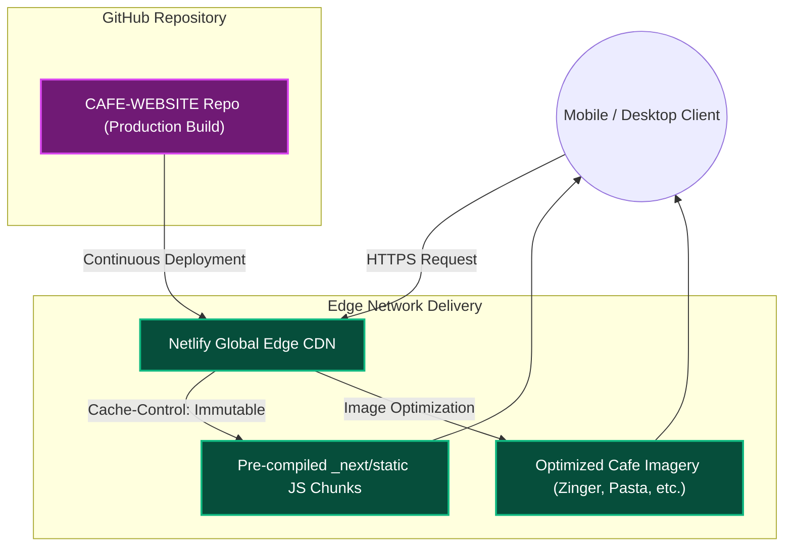

  <h1>☕ Gossip Cafe | Modern Web Experience</h1>
  
<strong>A highly optimized, performant landing page and digital menu experience for Gossip Cafe.</strong>

  

    
    
    
    
  

---

## 📖 Project Overview

This repository hosts the **production deployment build** for the Gossip Cafe web application. Engineered to deliver a lightning-fast user experience, the application transitions a traditional restaurant menu into a modern, highly interactive digital storefront. 

Originally prototyped as a monolithic HTML/CSS application, this iteration has been completely re-architected using **Next.js** to leverage static site generation (SSG) and edge caching, resulting in near-instantaneous page loads even on constrained mobile networks.

---

## ✨ Core Features & Technical Highlights

- 🚀 **Next.js Static Generation**: The entire site is pre-rendered into static HTML/JS/CSS (`_next` chunks) to guarantee zero layout shift and maximum SEO performance.
- 📱 **Mobile-First Responsive UI**: Styled with Tailwind CSS, ensuring the cafe's rich imagery (from signature Zinger Burgers to Peri Wraps) scales perfectly across all devices.
- ⚡ **Advanced Edge Caching**: Configured via `netlify.toml` with strict `Cache-Control: public, max-age=31536000, immutable` headers for Next.js static assets to leverage browser and CDN caching.
- 🖼️ **Optimized Asset Delivery**: High-quality UI assets (SVG icons, WOFF2 fonts, and optimized WebP/PNG images) are served directly from the edge.

---

## 🛠️ Detailed Technology Stack

### Front-End Engineering
* **Next.js**: Core framework for routing, compilation, and static asset generation.
* **React 18**: Underlying UI library powering component hydration.
* **Tailwind CSS**: Utility-first CSS framework used for pixel-perfect design constraints and responsive breakpoints.

### Infrastructure & Deployment
* **Netlify**: Serverless deployment platform handling global CDN distribution.
* **netlify.toml**: Infrastructure-as-code configuration defining custom headers, redirects, and image optimization pipelines.

---

## 🏗️ Production System Architecture

<b>View Deployment Architecture Diagram</b> (Click to expand)

---

## 📂 Repository Note
> [!NOTE]  
> **This repository contains the finalized production build artifacts** (the `.next` / `out` equivalents) required by Netlify for hosting, rather than the raw `.tsx` source code. This ensures the live environment perfectly mirrors the tested production bundle.

---

## 👨‍💻 Developed By

**Muhammad Mateen**  
*Full-Stack & Front-End Specialist*

- 🌐 **Portfolio**: [mmateenn.netlify.app](https://mmateenn.netlify.app/)
- 💼 **LinkedIn**: [muhammadmateen112](https://www.linkedin.com/in/muhammadmateen112/)
- 📧 **Email**: [meetmuhammadmateen@gmail.com](mailto:meetmuhammadmateen@gmail.com)
